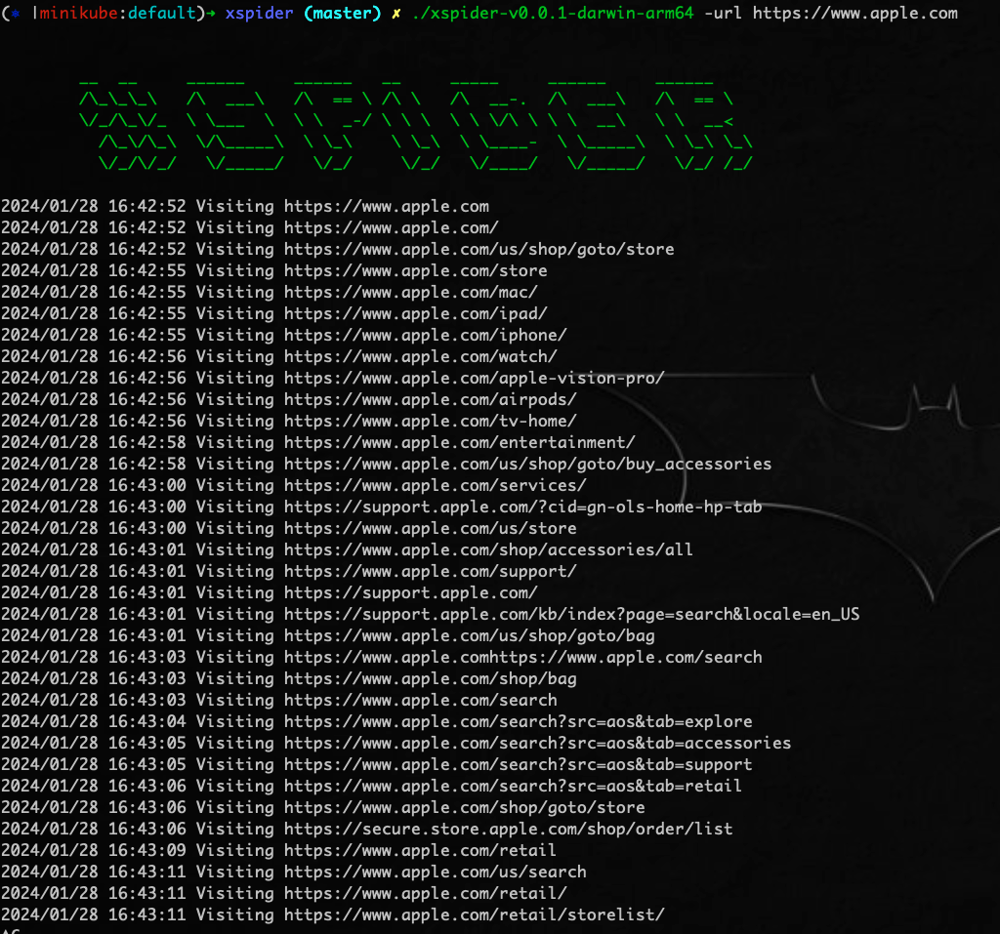
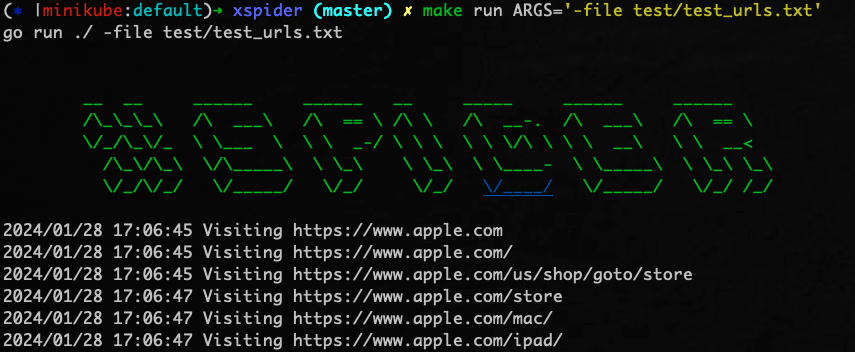
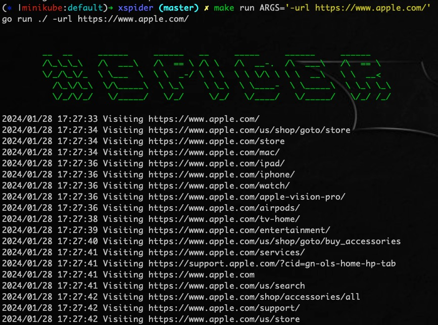

# XSpider

XSpider是一款高效的站点爬虫工具，采用深度遍历策略，持续发现并访问页面中的新链接。

# Screenshots


# 安装


# 使用指南
## 二进制文件运行
在[releases](https://github.com/Ithrael/XSpider/releases)下载二进制文件
```./xspider-v0.0.1-darwin-arm64 -url https://www.apple.com```


## 源码运行
```make help```


```make run ARGS='-file test/test_urls.txt'```


```make run ARGS='-url https://www.apple.com'```



